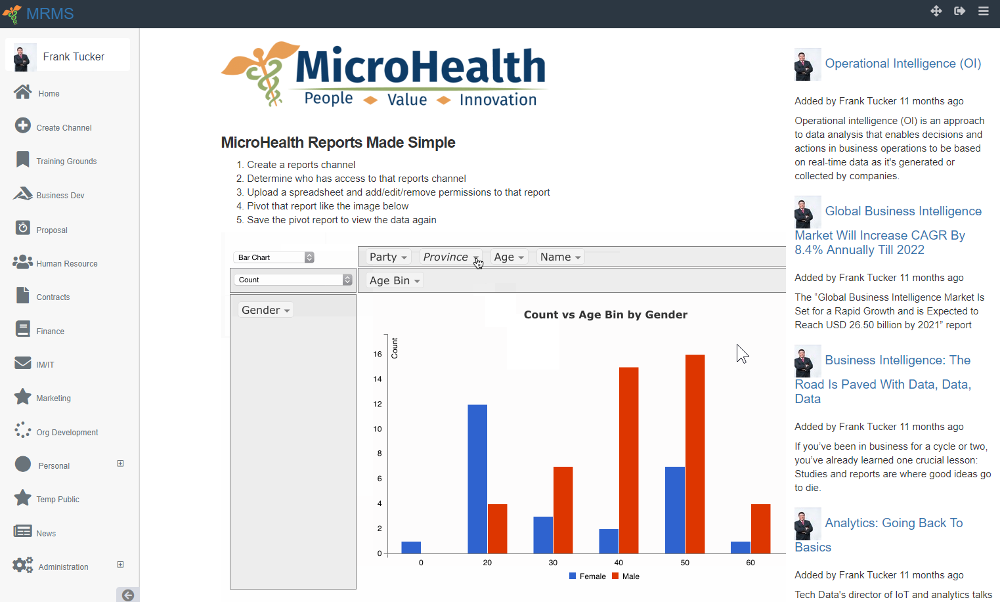

# mRMS
MicroHealth Reports Made Simple.  Think of it as rocket chat, slack or teams for reporting.  You create channels just like those systems however rather than a chat window, its a reporting window that have different reports from your data sets.  We tried a few reporting systems but ultimately, they were too complex for the masses to master.  So we made it as simple as possible that even the most junior person can create reports.  Your data set can be in excel or csv, working on other sources outlined in issues.  However, in reality we found every system out there we use can export to excel or csv meaning the reporting system would work on all the data sets out there. You can brand it and configure the social login.

# Installation:

update centos
yum update

yum install -y epel-release yum-utils

yum-config-manager --enable epel

yum clean all && sudo yum update -y

install ruby

gpg --keyserver hkp://keys.gnupg.net --recv-keys 409B6B1796C275462A1703113804BB82D39DC0E3

curl -sSL https://get.rvm.io | sudo bash -s stable

sudo usermod -a -G rvm `whoami`

export PATH="$PATH:$HOME/.rvm/bin"

logout then log back in

rvm install ruby-2.3.6

rvm install ruby-devel-2.3.6

bash -l -c "rvm use 2.3.6 --default"

Install Mysql
yum install mariadb-server mariadb

yum install mysql-devel

mysql -u root -p

create database mrss_prod CHARACTER SET utf8 COLLATE utf8_general_ci;

exit

be sure git is installed
yum install git

and Imagemagick
Install ImageMagick

and Redis
Install Redis

go to /var/www and from there
cd /var/www/

git clone https://github.com/iFixtechLLC/mRSS

nano /var/www/mRSS/config/database.yml

--enter the password for mysql where it says password then save and exit

go to the cloned directory
cd /var/www/mRSS

gem install rails

gem install bundler

yum install nodejs

bundle install

rails db:setup

rake assets:precompile

generate your secrets for config/secrets.yml
rake secret

put that output in config/secretys.yml

Configure Nginx repo for CentOS 7
nano /etc/yum.repos.d/nginx.repo

then enter this below and save
[nginx]

name=nginx repo

baseurl=http://nginx.org/packages/mainline/centos/7/$basearch/

gpgcheck=0

enabled=1

Update yum and install nginx
yum update

yum install -y nginx

install passenger phusion
yum install -y pygpgme curl

curl --fail -sSLo /etc/yum.repos.d/passenger.repo https://oss-binaries.phusionpassenger.com/yum/definitions/el-passenger.repo

yum install -y nginx passenger || sudo yum-config-manager --enable cr && sudo yum install -y nginx passenger

then go edit passenger.conf
nano /etc/nginx/conf.d/passenger.conf

-where it says passenger_ruby change what you see there to what you see below. If that doesn't work then do this "which passenger-config" to get the path to put next to passenger_ruby
passenger_ruby /usr/local/rvm/gems/ruby-2.3.6/wrappers/ruby;

--uncomment the line above and the line below along with the passenger_ruby line e.g. remove this"#"

restart nginx
service nginx restart
This project use Ruby 2.3+ and rails 5.0 and Mysql 

`Bundle install`

create mysql database simple_report

go to config directory and edit database.yml to connect to mysql

'rails generate simple_form:install'

`rake db:migrate`

and you should create an admin user 

Running the server

start your app rails s -e production -b localhost -d 
or 
rails s -e production > /dev/null &

start sidekiq bundle exec sidekiq -d -L log/sidekiq.log -C config/sidekiq.yml -e production

# Setup
go to your url of your install

log in with temp account admin with password Admin@2018

go to administration

Change, configure and customize your application

